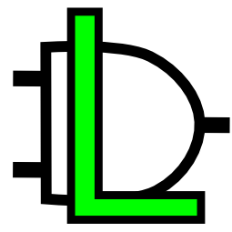

Organización y Arquitectura de Computadoras 🛠💻
=========================================

   &nbsp  &nbsp  &nbsp 
   

Curso Completo 2023-2
-------------------------------------------

### Profesor: José de Jesús Galaviz Casas

### Ayudantes

* María Ximena Lezama Hérnandez
* Sara Doris Montes Incin
* Ricardo Enrique Pérez Hernández

Prácticas, tareas y teoría realizadas durante el curso de Organización y Arquitectura de Computadoras.
